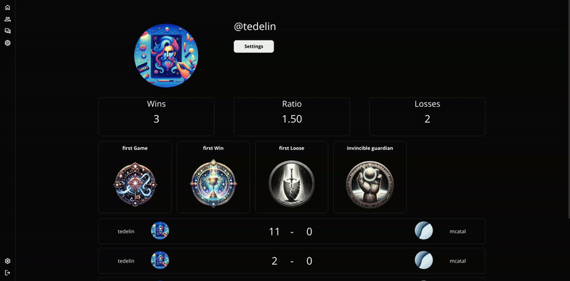

# ft_transcendence 🏓

## Description

Ft_transcendence is a fullstack web application build with React and NestJS allow you to play pong with your friend and chat with them.

## Installation

Copy the `.env.sample` into `.env` file and fill it with your credentials.

```bash
git clone git@github.com:tedelin/ft_transcendence.git
cd ft_transcendence
make
```

## Access

```bash
http://your_host
```

## Preview



## Additonal Commands

```bash
make stop # Stop the containers
```

```bash
make clean # Remove containers and volumes but keep images
```

```bash
make fclean # Remove containers volumes and images
```

```bash
make build # Start project and rebuild images
```

```bash
make down # Remove containers but keep volumes
```

## License

[MIT](https://choosealicense.com/licenses/mit/)
